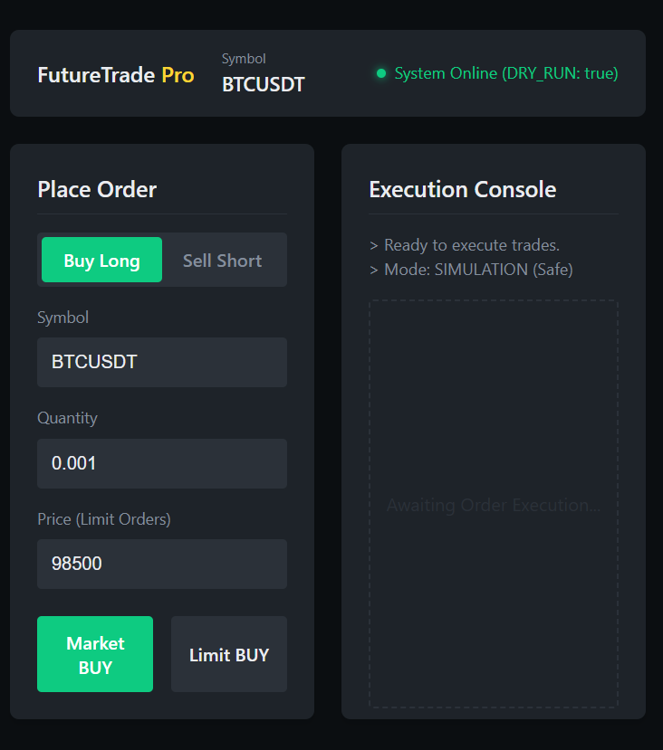
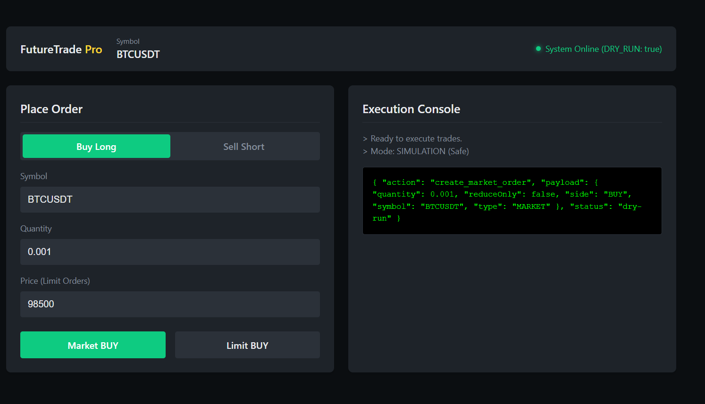
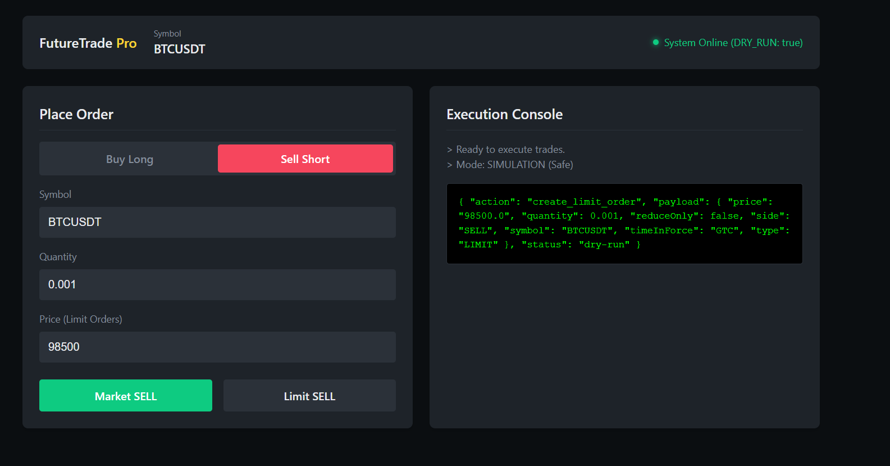

# FutureTrade Pro 🤖

**A Full-Stack Binance Futures Trading Bot & Dashboard**

  

**FutureTrade Pro** is a comprehensive automated trading solution that combines a robust **Python Trading Engine** with a modern **React Dashboard** and a flexible **REST API**. Designed for algorithmic traders who need safety (Dry-Run), visibility (Dashboard), and extensibility.

---

## 📸 UI Gallery

Experience the dark-themed, professional trading terminal.

| Dashboard Overview | Order Execution | Console Logs |
|:---:|:---:|:---:|
|  |  |  |

---

## 🚀 Quick Start (Full Stack)

Get the entire system (Frontend + Backend) running in minutes.

### 1. Prerequisites
*   Python 3.8+
*   Node.js & npm
*   Binance Futures Account (API Key & Secret)

### 2. Setup Backend
1.  **Clone & Install**:
    ```bash
    git clone https://github.com/yourusername/tushar-binance-bot.git
    cd tushar-binance-bot
    pip install -r requirements.txt
    ```
2.  **Configure Credentials**:
    Create a `.env` file in the root:
    ```ini
    BINANCE_API_KEY=your_api_key
    BINANCE_API_SECRET=your_api_secret
    DRY_RUN=True  # Set to False for real trading
    ```
3.  **Launch API**:
    ```bash
    python api/server.py
    ```
    *Server runs on `http://localhost:5000`*

### 3. Setup Frontend
1.  **Install & Run**:
    Open a new terminal:
    ```bash
    cd frontend
    npm install
    npm run dev
    ```
2.  **Access Dashboard**:
    Open **[http://localhost:5173](http://localhost:5173)** in your browser.

---

## ✨ Features

### 🖥️ **Modern React Dashboard**
*   **Real-Time Connectivity**: Live ping check to the backend.
*   **Professional UI**: specific color cues for BUY (Green) and SELL (Red) actions.
*   **JSON Console**: View raw API responses directly in the UI for debugging.

### 🔌 **Flask REST API**
*   **Unified Interface**: Wraps the Python bot logic into standard HTTP endpoints.
*   **Endpoints**:
    *   `GET /api/ping`: System health check.
    *   `POST /api/market`: Place market orders.
    *   `POST /api/limit`: Place limit orders.

### 🛡️ **Safety-First Core**
*   **Dry-Run Mode**: Defaults to simulation mode. Validate logic without risking a cent.
*   **Input Validation**: Strict checks on symbols, quantities, and prices before API submission.
*   **Logging**: Detailed rotating logs in `bot.log`.

---

## 🛠️ CLI Usage (Legacy)

You can still use the bot via command line for headless operations.

**Market Order (Dry-Run)**
```bash
python src/cli.py market BTCUSDT BUY 0.001 --dry-run
```

**Limit Order (Dry-Run)**
```bash
python src/cli.py limit BTCUSDT BUY 0.001 45000 --dry-run
```

**Generate PDF Report**
Valdiate your setup with a comprehensive PDF report:
```bash
python generate_pdf_report.py
```

---

## 🧩 Architecture

The project follows a modular "Clean Architecture" design:

```
tushar-binance-bot/
├── api/                 # Flask Backend
│   └── server.py        # API Entrypoint
├── frontend/            # React Frontend
│   └── src/             # UI Source
├── src/                 # Core Trading Logic
│   ├── config.py        # Settings & Env
│   ├── logger.py        # Centralized Logging
│   └── orders/          # Order Execution Modules
└── images/              # Project Screenshots
```

## 🤝 Extending

*   **New Strategies**: Add scripts in `src/orders/advanced/` (e.g., Grid, TWAP).
*   **New API Endpoints**: Add route handlers in `api/server.py`.
*   **UI Components**: Edit `frontend/src/App.jsx` to add charts or new forms.
